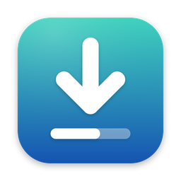

  

# YTDL

YTDL is a small macOS app that puts a window on top of the
[yt-dlp](https://github.com/yt-dlp/yt-dlp) command-line tool. Paste video or
playlist links, choose video or audio only, and it downloads several videos at
once, with a progress bar for each one.

This repository holds the public documentation for the app: how to install
and use it, what it stores on your Mac, and the terms it comes with. The
app's source code is kept in a separate, private repository.

> **Before you use it:** YTDL is a tool. What you download with it, and
> whether you are allowed to, is your responsibility. Read the
> [disclaimer](DISCLAIMER.md).

<!-- TODO(maintainer): say where builds can be downloaded, for example the
     Releases page of this repository, once you publish one. Until then the
     installation guide describes installing from a disk image you already have. -->

## What it does

- **Videos and playlists.** Paste one or many links. A playlist becomes one
  row per video.
- **Parallel downloads.** Up to 8 videos at a time, each with its own progress
  bar, speed and time left.
- **Video or audio only.** Resolution caps from 480p to 4K, or audio as M4A,
  MP3, Opus, FLAC, WAV or the original stream.
- **Pause, resume, cancel.** For one video or a selection. Cancelling can
  clean up the partial files.
- **Automatic retries.** Failed downloads try again with waits that double
  each time.
- **Statistics.** Size, time taken, average and peak speed, resolution and
  codecs for every video.
- **History.** A searchable list of everything downloaded, with "Download
  Again".
- **Picks up where it left off.** Unfinished downloads come back, paused, the
  next time the app opens.

## Requirements

- macOS 13 (Ventura) or later
- [yt-dlp](https://github.com/yt-dlp/yt-dlp), installed separately
- [ffmpeg](https://ffmpeg.org), installed separately
- Recommended for YouTube: a JavaScript runtime such as
  [Deno](https://deno.com)
- Optional: [aria2](https://aria2.github.io) for multi-connection downloads

YTDL does not include any of these tools. The
[installation guide](docs/installation.md) shows how to install them.

## Documentation

| Page | What it covers |
|---|---|
| [Installation](docs/installation.md) | Installing the tools and the app, first launch |
| [User guide](docs/user-guide.md) | Adding links, playlists, pause and resume, history |
| [Settings](docs/settings.md) | Every setting, tab by tab |
| [Troubleshooting](docs/troubleshooting.md) | What to check when something does not work |
| [FAQ](docs/faq.md) | Short answers to common questions |
| [Changelog](CHANGELOG.md) | What changed in each version |

## Terms and notices

| Page | What it covers |
|---|---|
| [Disclaimer](DISCLAIMER.md) | Acceptable use, no warranty, no affiliation |
| [Privacy](PRIVACY.md) | What the app stores and where, and what leaves your Mac |
| [Third-party software](THIRD_PARTY.md) | The tools YTDL relies on and their licenses |
| [Security](SECURITY.md) | How to report a security problem |

## Getting help

Start with [Troubleshooting](docs/troubleshooting.md) and the
[FAQ](docs/faq.md). If that does not solve it, see [SUPPORT.md](SUPPORT.md)
for how to open an issue with the details that make it quick to answer.

## Contributing

Corrections and improvements to these documents are welcome; see
[CONTRIBUTING.md](CONTRIBUTING.md). Everyone taking part is expected to
follow the [code of conduct](CODE_OF_CONDUCT.md).

## License

<!-- TODO(maintainer): choose a license for these documents (and say how the
     app itself is licensed), add a LICENSE file, and replace the sentence below. -->

No license has been chosen for this repository yet. Until a `LICENSE` file is
added, the usual copyright rules apply: you may read and link to these
documents, but not republish them.

YouTube is a trademark of Google LLC. YTDL is not affiliated with, endorsed
by, or sponsored by Google, YouTube, or the yt-dlp project.
